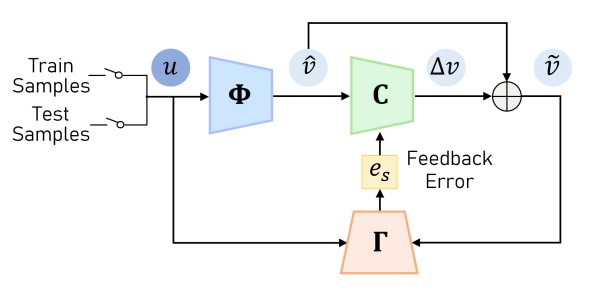
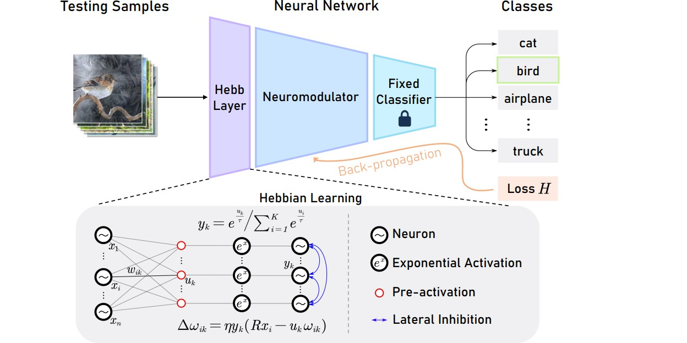

I’m Shuoshuo Chen (陈烁硕), a third-year Master student in the Department of Electronic and Electrical Engineering at Southern University of Science and Technology, advised by Professor [Zhihai He](https://www.sustech.edu.cn/en/faculties/zhihaihe.html). My research interests focus on the generalization capability of machine learning models for vision tasks. You can find my CV here: [Shuoshuo Chen](../files/ShuoshuoChen_CV.pdf).

## Education
**Master of Electronic Science and Technology, *SUSTech*, 2021 - 2024 (expected)**
- Research in [Artificial Intelligence Lab](https://nkdailab.github.io/ )
  
**Bachelor of Information Engineering, *SUSTech*, 2017 - 2021**
- Excellent Graduate, Jun., 2021
- Merit Student Scholarship, Nov., 2018 - Nov., 2020

## Publication

    
    
<strong>[CVPR2023]</strong><a href="https://openaccess.thecvf.com/content/CVPR2023/papers/Kan_Self-Correctable_and_Adaptable_Inference_for_Generalizable_Human_Pose_Estimation_CVPR_2023_paper.pdf">Self-Correctable and Adaptable Inference for Generalizable Human Pose Estimation</a>  Zhehan Kan, <strong>Shuoshuo Chen</strong>, Ce Zhang, Yushun Tang and Zhihai He

    
    
<strong>[CVPR2023]</strong><a href="https://openaccess.thecvf.com/content/CVPR2023/papers/Tang_Neuro-Modulated_Hebbian_Learning_for_Fully_Test-Time_Adaptation_CVPR_2023_paper.pdf">Neuro-Modulated Hebbian Learning for Fully Test-Time Adaptation</a>  Yushun Tang, Ce Zhang, Heng Xu, <strong>Shuoshuo Chen</strong>, Jie Cheng, Luziwei Leng, Qinghai Guo and Zhihai He

